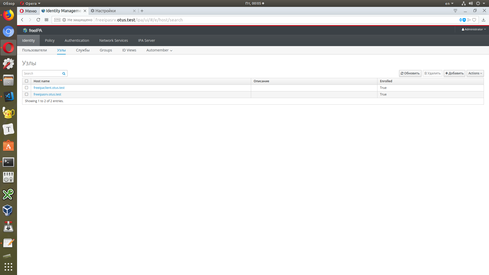

## LDAP. Централизованная авторизация и аутентификация

1. Установить FreeIPA
2. Написать playbook для конфигурации клиента
3. Настроить авторизацию по ssh-ключам

В git - результирующий playbook                              

#### Сервер Freeipa

Сервер и клиентская машина подгатавливаются с помощью Vagrantfile

Развернул сервер с помощью :

```
ansible-playbook freeipasrv.yml
```

#### Клиент Freeipa

```
ansible-playbook freeipaclient.yml
```

#### Пруфшот




#### Авторизация по ssh-ключам

Создаю ключи

```
ssh-keygen -t rsa -C admin@otus.test
```

Добавляю

```
cat /root/.ssh/id_rsa.pub
ipa user-mod admin --sshpubkey="ssh-rsa AAAA ... admin"
```