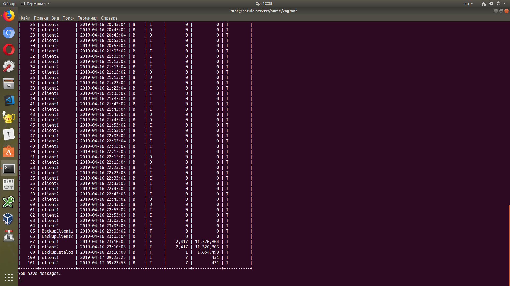
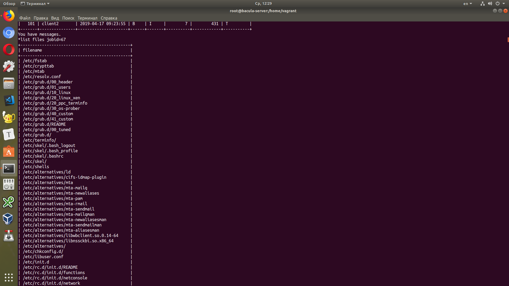

## Резервное копирование

Настраиваем бэкапы

Настроить стенд Vagrant с двумя виртуальными машинами server и client.

Настроить политику бэкапа директории /etc с клиента:
1) Полный бэкап - раз в день
2) Инкрементальный - каждые 10 минут
3) Дифференциальный - каждые 30 минут

Запустить систему на два часа. Для сдачи ДЗ приложить list jobs, list files jobid=<id>
и сами конфиги bacula-*

\* Настроить доп. Опции - сжатие, шифрование, дедупликация                              

Сервер с  2 клиентами развернут из haf/vagrant-bacula:

- резервное копирование  /etc (Полный раз в день, Инкрементальный раз в 10 минут, Дифференциальный раз в 30 минут)
- сжатие GZIP
- дедупликация на client2

list jobs

list files

