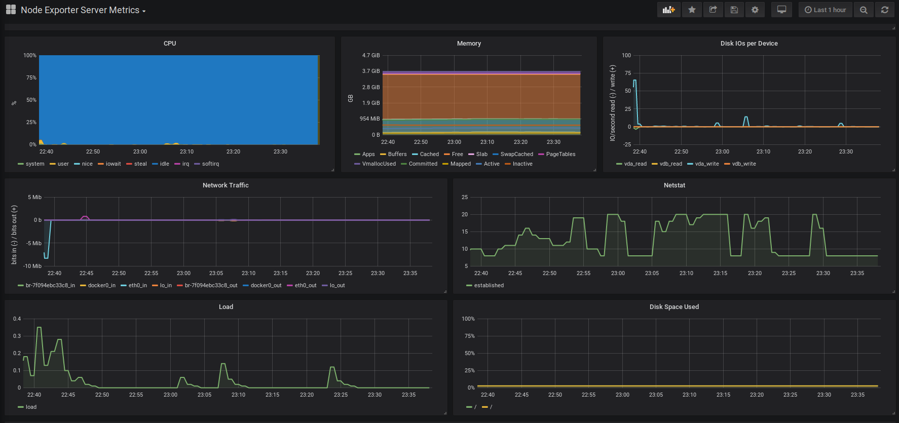

## Домашнее задание

Настройка мониторинга
Настроить дашборд с 4-мя графиками
1) память
2) процессор
3) диск
4) сеть

настроить на одной из систем
- zabbix (использовать screen (комплексный экран))
- prometheus - grafana

* использование систем примеры которых не рассматривались на занятии

- список возможных систем был приведен в презентации


#### Prometheus - Node Exporter - Graphana



Развернут сервер Prometheus - 165.22.76.141

```
curl -LO https://github.com/prometheus/prometheus/releases/download/v2.9.1/prometheus-2.9.1.linux-amd64.tar.gz

tar xvf prometheus*.linux-amd64.tar.gz

cp prometheus-2.9.1.linux-amd64/prometheus /usr/local/bin/

cp prometheus-2.9.1.linux-amd64/prometheus/promtool /usr/local/bin/

sudo chown prometheus:prometheus /etc/prometheus/prometheus.yml

chown prometheus:prometheus /usr/local/bin/prometheus

chown prometheus:prometheus /usr/local/bin/promtool

mkdir /etc/prometheus

mkdir /var/lib/prometheus

chown prometheus:prometheus /etc/prometheus

chown prometheus:prometheus /var/lib/prometheus

vi /etc/prometheus/prometheus.yml

chown prometheus:prometheus /etc/prometheus/prometheus.yml

systemctl daemon-reload

systemctl start prometheus

systemctl enable prometheus
```

Node Exporter

```
wget https://github.com/prometheus/node_exporter/releases/download/v0.17.0/node_exporter-0.17.0.linux-amd64.tar.gz

tar xvfz node_exporter-*.*-amd64.tar.gz

cp node_exporter-*.*-amd64/node_exporter /usr/local/bin/

chown node_exporter:node_exporter /usr/local/bin/node_exporter

systemctl daemon-reload

systemctl start node_exporter

systemctl enable node_exporter


```

Аутентификация через Nginx + httpd-tools

```
htpasswd -c /etc/nginx/.htpasswd login
```

Grafana

```
vi /etc/yum.repos.d/grafana.repo

yum install grafana

systemctl start grafana-server

systemctl enable grafana-server

firewall-cmd --add-port=3000/tcp --permanent

firewall-cmd --reload
```

