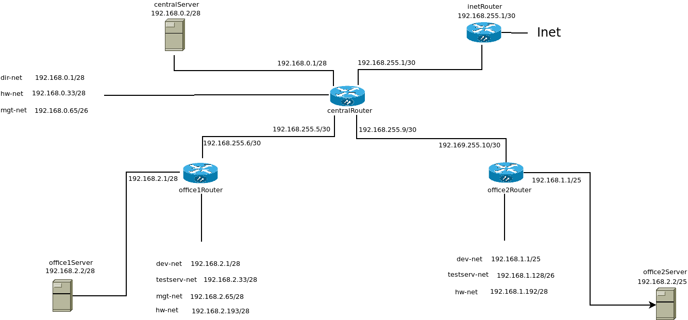

## Домашнее задание

#### Теория

- Найти свободные подсети
- Посчитать сколько узлов в каждой подсети, включая свободные
- Указать broadcast адрес для каждой подсети

#### Сеть office1

```
192.168.2.0/26 - dev
Broadcast 	192.168.2.63
Hostmin 	192.168.2.1
Hostmax 	192.168.2.62
Hosts 	62
```

```
192.168.2.64/26 - test servers
Broadcast 	192.168.2.127
Hostmin 	192.168.2.65
Hostmax 	192.168.2.126
Hosts 	62
```

```
192.168.2.128/26 - managers
Broadcast 	192.168.2.191
Hostmin 	192.168.2.129
Hostmax 	192.168.2.190
Hosts 	62
```

```
192.168.2.192/26 - office hardware
Broadcast 	192.168.2.255
Hostmin 	192.168.2.193
Hostmax 	192.168.2.254
Hosts 	62
```

В сети offcie1 больше нет свободных подсетей, так как вся 192.168.2.0/24 разбита на 4 подсети /26.
Суммарное возможное количество хостов 248

#### Сеть office2

```
192.168.1.0/25 - dev
Broadcast 	192.168.1.127
Hostmin 	192.168.1.1
Hostmax 	192.168.1.126
Hosts 	126
```

```
192.168.1.128/26 - test servers
Broadcast 	192.168.1.191
Hostmin 	192.168.1.129
Hostmax 	192.168.1.190
Hosts 	62
```

```
192.168.1.192/26 - office hardware
Broadcast 	192.168.1.255
Hostmin 	192.168.1.193
Hostmax 	192.168.1.254
Hosts 	62
```

В сети offcie2 больше нет свободных подсетей, так как вся 192.168.1.0/24 разбита на 1 подсеть /25 и 2 подсети /26.
Суммарное возможное количество хостов 250

#### Сеть central

```
192.168.0.0/28 - directors
Broadcast 	192.168.0.15
Hostmin 	192.168.0.1
Hostmax 	192.168.0.14
Hosts 	14
```

```
192.168.0.32/28 - office hardware
Broadcast 	192.168.0.47
Hostmin 	192.168.0.33
Hostmax 	192.168.0.46
Hosts 	14
```

```
192.168.0.64/26 - wifi
Broadcast 	192.168.0.127
Hostmin 	192.168.0.65
Hostmax 	192.168.0.126
Hosts 	62
```

В сети central есть свободные подсети

```
    Network:   192.168.0.16/28
    Broadcast: 192.168.0.31
    HostMin:   192.168.0.17
    HostMax:   192.168.0.30
    Hosts/Net: 14
    Network:   192.168.0.48/28
    Broadcast: 192.168.0.63
    HostMin:   192.168.0.49
    HostMax:   192.168.0.62
    Hosts/Net: 14
    Network:   192.168.0.128/25
    Broadcast: 192.168.0.255
    HostMin:   192.168.0.129
    HostMax:   192.168.0.254
    Hosts/Net: 126
```

Суммарное возможное количество хостов 244

Также остаются свободными подсети.

```
    10.0.0.0/16 (Broadcast: 10.0.255.255 Hosts/Net: 65534)
    172.16.0.0/16 (Broadcast: 172.16.255.255 Hosts/Net: 65534)
    192.168.{3..252}.0/24 (Broadcast: 192.168.{3..252}.255 Hosts/Net: 254)
    192.168.253.4/30 (Broadcast: 192.168.253.7 Hosts/Net: 2)
    192.168.253.8/30
    192.168.253.12/30
    ...
    192.168.253.252/30
    192.168.254.4/30
    192.168.254.8/30
    192.168.254.12/30
    ...
    192.168.254.252/30
    192.168.255.4/30
    192.168.255.8/30
    192.168.255.12/30
    ...
    192.168.255.252/30
```


#### Практика

- Соединить офисы в сеть согласно схеме и настроить роутинг
- Все сервера и роутеры должны ходить в инет черз inetRouter
- Все сервера должны видеть друг друга
- у всех новых серверов отключить дефолт на нат (eth0), который вагрант поднимает для связи
- при нехватке сетевых интервейсов добавить по несколько адресов на интерфейс

