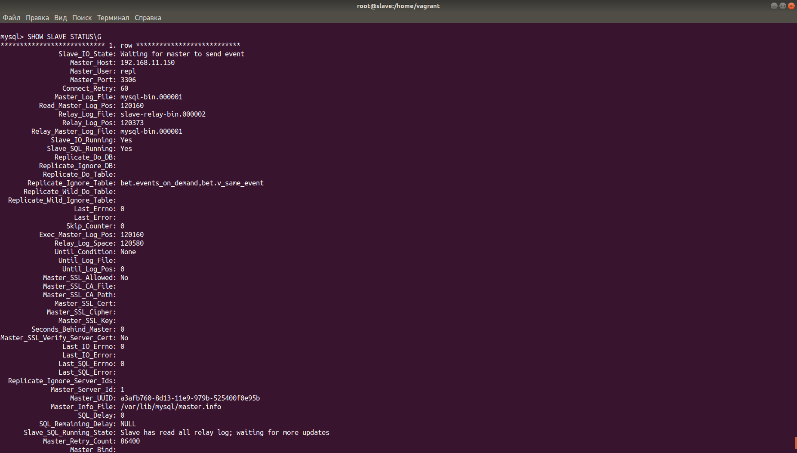
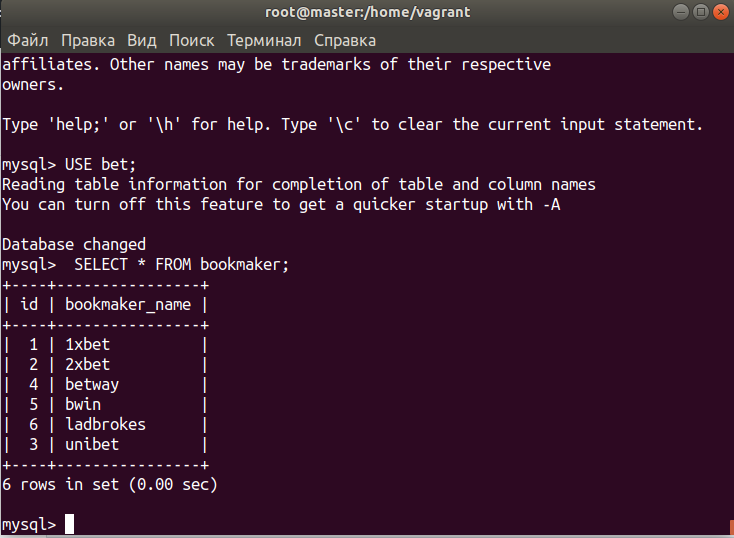
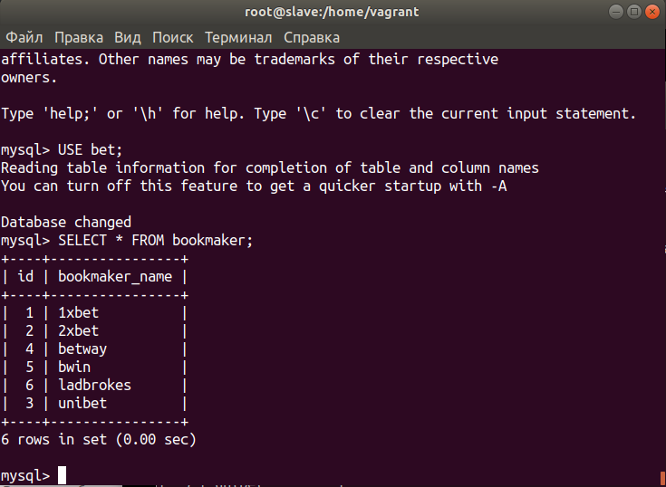

## Mysql

#### Домашнее задание 

развернуть базу из дампа и настроить репликацию В материалах приложены ссылки на вагрант для репликации
и дамп базы bet.dmp
базу развернуть на мастере
и настроить чтобы реплицировались таблицы
| bookmaker         |
| competition        |
| market                 |
| odds                     |
| outcome

\*   Настроить GTID репликацию

###### Master

Устанавливаю Percona 

https://www.percona.com/doc/percona-server/5.7/installation/yum_repo.html#installing-percona-server-from-percona-yum-repository

Копирую конфиги

Беру пароль из логов 

```
cat /var/log/mysqld.log | grep 'root@localhost:' | awk '{print $11}'
```

Устанавливаю пароль

```
mysql > ALTER USER USER() IDENTIFIED BY 'YourStrongPassword';
```

Проверяю server_id

```
mysql> SELECT @@server_id;
```

Проверяю GTID

```
mysql>SHOW VARIABLES LIKE 'gtid_mode';
```

###### Slave

Копирую конфиги

Правлю в /etc/my.cnf.d/01-basics.cnf директиву server-id = 2

Раскомментирую в /etc/my.cnf.d/05-binlog.cnf строки:

```
#replicate-ignore-table=bet.events_on_demand

#replicate-ignore-table=bet.v_same_event
```

Таким образом указываю таблицы которые будут игнорироваться при репликации

Запускаю slave

```
mysql> CHANGE MASTER TO MASTER_HOST = "192.168.11.150", MASTER_PORT = 3306, MASTER_USER = "repl", MASTER_PASSWORD = "!OtusLinux2018", MASTER_AUTO_POSITION = 1;

mysql> START SLAVE;

mysql> SHOW SLAVE STATUS\G
```



Проверяю master



Проверяю slave




С заливкой бэкапа на слэйв получил

```
Error 'Can't create database 'bet'; database exists' on query. Default database: 'bet'. Query: 'CREATE DATABASE bet'
```

Соответственно, эту часть опустил.